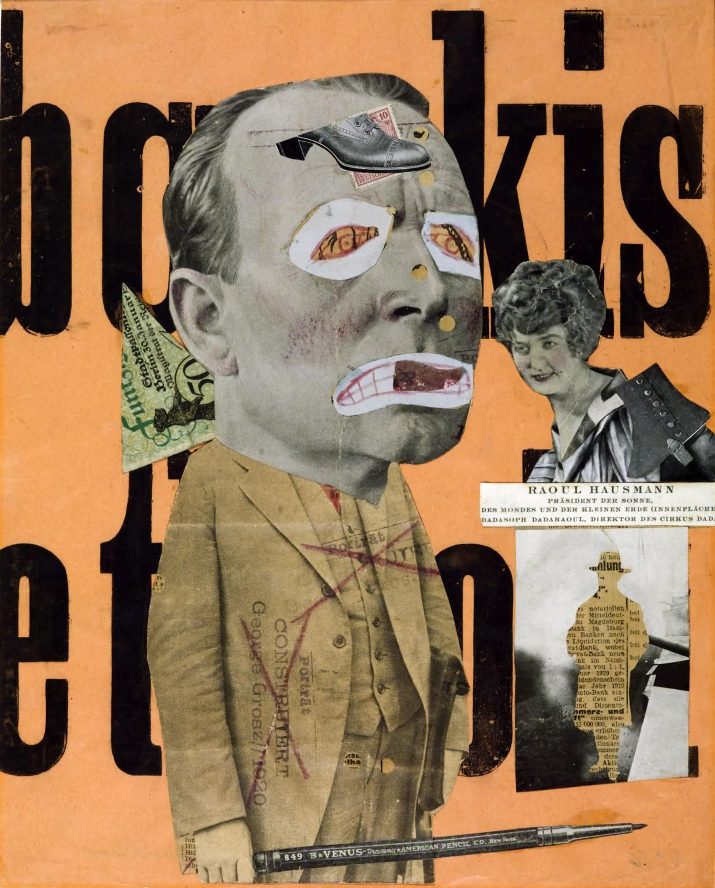
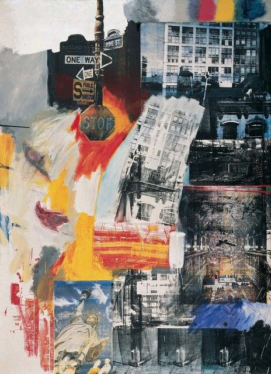
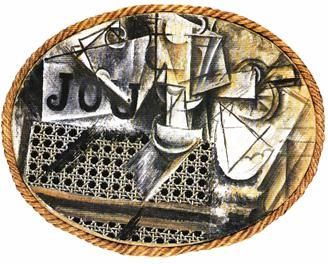
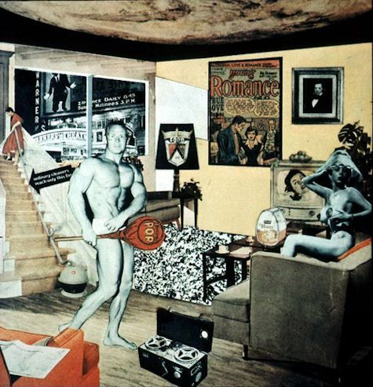
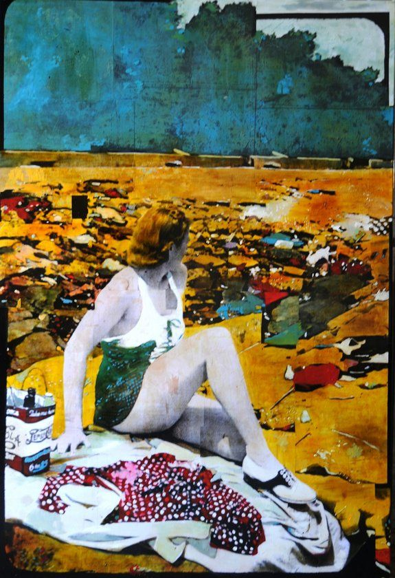
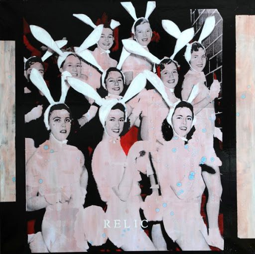
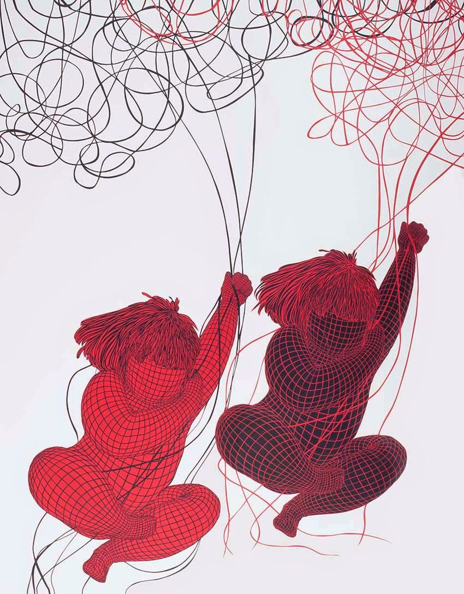

# Tasarım Sözlüğü: Kolaj

Oluşturan: Atahan Göktürk Güner
Oluşturuldu: May 2, 2021 10:00 PM
Son Düzenleyen: GÖKSU GÖKTÜRK
Tamamlandı: No

[KAYNAKÇA](https://www.notion.so/KAYNAK-A-07cb28cf75ec4fa8aaae162c72e4153c)

Kolaj, Fransızca **colle(tutkal)+ age= yapıştırmak** sözcüğünden alıntıdır. Colle, Latince aynı anlama gelen *colla* sözcüğünden evrilmiş bir sözcüktür. Türkçe karşılığı ise 'kes-yap 'tır.   

“Kolajın sözlük anlamı; Elde mevcut her tür basılı, çizili ya da fotografik malzemenin bir yüzey üzerine yeni bir kompozisyon oluşturacak düzende yapıştırılmasıyla elde edilir. Böylelikle kendileri sanatsal nitelikte olmayan çeşitli malzemeler, yalnızca yeni bir kompozisyon oluşturmak için kullanımları sayesinde bir sanat yapıtı meydana getirirler. Bu durumda sanatsal üretim süreci sadece bir kompoze etme etkinliğine indirgenmiş olur.” (Sanat Kavram ve Terimleri Sözlüğü, Metin Sözen & Uğur Tanyeli, 1986, s134)

Eser: Raoul Hausman

Eser: Robert Rauschenberg

Raoul Hausman, 'Mekanik Kafa'

Kolaj, eldeki malzemeler hayal gücüne bırakılarak kurgulanır. Birbiriyle ilişkisiz görünen zıtlıkları bir araya getirerek şaşırtıcı, merak uyandıran bir eser ortaya çıkartmak amaçlanır. Sanatçıların bu malzemeleri kullanmaları ile birlikte; tek başına sanatsal bir niteliğe sahip olmayan bu imgeler ve nesneler, bir kompozisyon içinde değerlendirilmiş ve sanat eserinin bir öğesi olarak kullanılmıştır. 

Kolaj sadece sanat değil birçok tasarım disiplininde de bir anlatım aracı olarak kullanılan görsel bir dildir. Kolaj yapısı gereği sanat ve tasarım uygulamalarında fikir üretmede hızlı ve yaratıcı çözümler üretmede çeşitliliğinin verdiği özgürlük alanı oluşturur. 

İki boyutlu tuval üzerindeki etkisi kadar heykel yapılarında ve ürünleşmede kolajın çok büyük bir katkısı vardır. Kolajın daha çok üç boyutlu eserlerde uygulanmasına **Asamblaj** denir. 

Wolf Vostell, 'Sara -Jeva'

Tarihte Mısır heykellerinde, Bizans ikonalarında, Japon sanatında, Orta Asya Türk devletlerinde, Hunlarda ve Uygur Türklerinde kumaş, kağıt, boncuk gibi hazır malzemelerin yapıştırma, ekleme veya dikme yöntemleriyle bir araya getirilmesi olarak karşımıza çıkmıştır. Tuval resminde kolaj tekniğinin sanat tarihinde yer bulması Kübizm akımıyla birlikte oldu. 20. yüzyılda Kübizmle birlikte sanatçılar resmin sınırlarını zorlayan malzeme ve yöntem kullanımıyla geleneksel anlayışın dışına çıkan eserler ürettiler. Picasso ve Braque boya ve fırça gibi geleneksel resim malzemelerinin yanında kumaş, gazete, dergi, vb. malzemeleri kullanarak kolaj tekniğinde eserler üretmiş ve yeni bir düşüncenin ortaya çıkmasını sağlamışlardır.

Daha sonra Dadacılar ve Gerçeküstücüler tarafından geliştirilen **Fotomontaj** tekniğinin öncüsü kolajdır. Yine II. Dünya savaşı sonrasında orta çıkan Pop art, Yeni Dada, Yeni Gerçekçilik gibi akımların eserlerinin de ilham kaynağıdır. 

George Braque, “Klarnet Natürmortu"

“Kübist resimle birlikte malzemenin resme girişi, tuvalin olanaklarını arttırmış ve tuval nesnesinin sadece bir yanılsamadan ibaret olmadığının fark edilmesini sağlamıştır”[1]

Kolaj, malzemesi ne olursa olsun, izleyicide gerçeklik duygusunu oluşturmak için yansımacı bir anlayışla dış gerçekliği iç gerçeklikle bağdaştırarak kurmaca gerçekliği kurmaktır. Bu kurmaca gerçeklik, yansıtmacı sanat anlayışında ulaşmak istenenin pekiştirilmiş bir vurgusudur. Bu vurguya ulaşmak isteyen çağımız sanatçısı kolajın dışında kendini ifade ederken araç olarak çok seçmeli. Sınırsız bir dil zenginliğiyle kendini doğru anlatabilme şansını elde eder.[2]

Pablo Picasso, Bambu Sandalyeli Natürmort, 29x37 cm, kolaj, 1913

George Grozs ve John Heartfield, Dada Merika, kolaj, 1920 

Richard Hamilton, Bugünün Evlerini Bu Denli Cazip Kılan Nedir? Kolaj,1956

Henri Matisse, Kolaj, The Museum of Modern Art, New York,1953

> "Tam olarak önemsediğimiz ve nasıl kullanacağımızı bilmediğimiz malzemelerle gerçekliği ifade etmeyi araştırdık."- Guillaume Apollinaime[3]

> "Kübizmde desen, tasarım, ve renk, bütün diğer ekollerde olduğu gibi aynı yaklaşımla ve aynı ruhla algılanmış ve uygulanmıştır. Resme daha önce görmezlikten gelinen nesneler ve biçimler soktuğumuz için, kübizm konuları farklı olabilir. Gözlerimizi ve beynimizi çevremize açık tuttuğumuz söylenebilir. - Pablo Picasso[4]

> "Birbiri ile ilişkisiz parçaları, gerçek fonksiyonlarını yitirterek, birbirine monte edilmesiyle yeni bir gerçeklik olgusu yaratan montaj tekniği sayesinde, her tür sıradan nesne, sanatın malzemesine dönüşebilir.”[5]

> “Resimlerimde kullandığım yapıştırma kağıtlar, ahşap taklitleri- ve benzeri başka öğeler-bu öğelerin anlaşılırlığından dolayı başarılı olmuş, onların trompe l’oeil gibi algılanmasına yol açmıştır, oysa durum tam tersidir. Bu basit ögeler aklın ürünü olarak espasta yeni bir biçimin meşru kılınmasına yardımcı olur”- Georges Braque[6]

 *trompe l’oeil*: gözü yanıltan illüzyonist resim.*

> “Bir gezgin kırık porselen parçaları bulur. Yapıştırıcıyla işe girişir ve bu parçaların bir çay tabağı şekli aldığını görür. Bu porselenin eski sahibi, kırılmadan önce bunun aslında bir çay fincanı olduğunu söyler. Ondan önceki sahibi ise çay fincanından da önce aslında bir Adonis heykelciği olduğunu anlatır. Bu hikâyenin özü şu; Her parça aslında bulunmuş ve sonra bir araya getirilmiştir” - Richard Aldrich[7]

Ardan Özmenoğlu, Coffeetime, Post-it not kağıtları üzerine karışık teknik, 2014.

Eser: Ayline Olukman

Eser: Arda Özmenoğlu

Sabire Susuz, İsimsiz(Detay), 100x100 cm,
saten kumaş üzerine tekstil etiket, 2006.

Eser: Ayline Olukman

Ayça Telgeren, ‘Sanatçının Eli’, 6 Haziran 2015